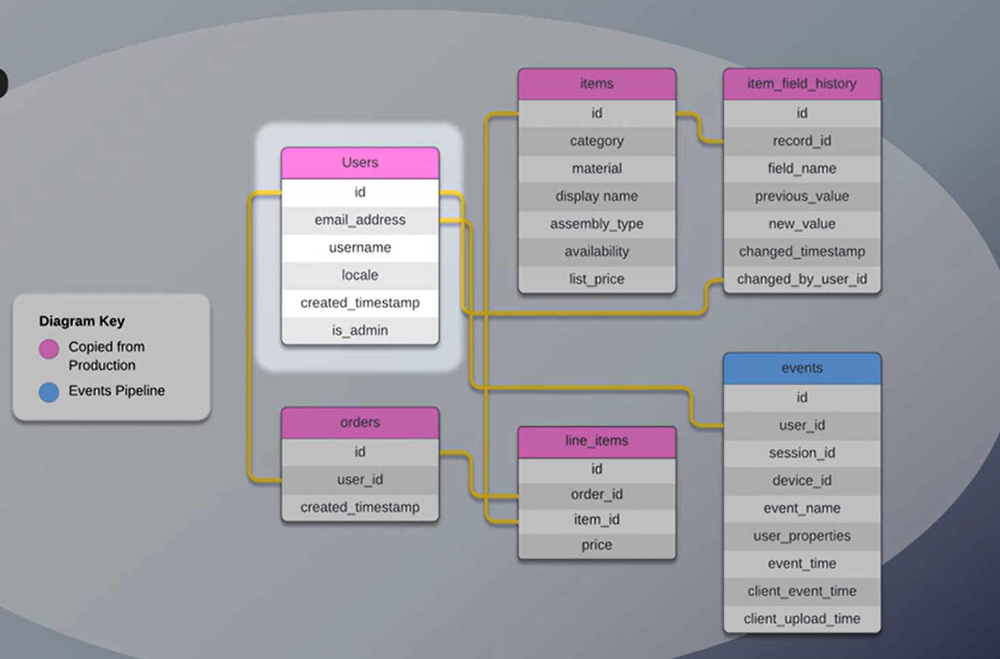

# Widgetshop E-commerce Data Analysis - SQL Project

## Problem Statement

Analyzed e-commerce user behavior and sales data to derive actionable insights for optimizing user engagement, improving conversion rates, 
and understanding product performance. Focused on identifying key user journeys, measuring funnel efficiency, and assessing item popularity 
and purchasing patterns to inform strategic business decisions.

**Key Learnings & Skills Demonstrated:**
* **SQL Proficiency:** Advanced querying techniques including CTEs, window functions, and joins for complex data extraction and manipulation.
* **Data Analysis:** Identifying trends, calculating key metrics (e.g., conversion rates, retention rates), and understanding user journeys.
* **Business Intelligence:** Translating raw data into meaningful business insights, informing strategies for user engagement, product management, and marketing.
* **Event Log Analysis:** Investigating and reconciling inconsistencies in event tracking (`view_item` vs. `item_view`) to ensure data accuracy.
* **Funnel Analysis:** Quantifying user progression through key conversion steps (e.g., login, add-to-cart).
* **Retention Analysis:** Implementing cohort-based retention to track user engagement over time.
* **Data Normalization/Denormalization:** Understanding and applying principles for optimized reporting.

## Database Schema

The analysis is based on the following e-commerce database schema:

**Tables:**
* `users`: User information (ID, email, locale, timestamps).
* `items`: Product details (ID, category, display name, price, availability).
* `orders`: Order information (ID, user ID, created timestamp).
* `line_items`: Details of items within each order (order ID, item ID, price).
* `events`: User interaction logs (ID, user ID, session ID, event name, time).
* `item_field_history`: Log of changes to item fields (auditing, historical prices).

## Analysis Questions & Insights

The `Widgetshop.sql` file contains the SQL queries addressing the following business questions:

### General Analysis
* **Item Selection:** Querying all items within a specific category (e.g., 'Widget').
* **Pricing Insights:** Calculating the average price of items per category.
* **User Demographics:** Identifying the most common user locale.

### User & Order Behavior
* **User Engagement:** Determining the percentage of users who have viewed an item.
* **Conversion to Order:** Calculating the percentage of users who have placed an order.
* **Re-order Frequency:** Analyzing how often users re-order.
* **Product Performance:** Identifying items that have never been purchased.
* **Popularity:** Determining the most popular category of items based on purchases.

### Funnel & Activation Analysis
* **Login Success Rate:** Calculating the percentage of logins that are successful within a specific timeframe (e.g., 5 minutes) and over time.
* **View-to-Cart Conversion:** Analyzing the percentage of item views that lead to an "add to cart" action.

### Advanced Analysis & Techniques
* **Event Log Reconciliation:** Detailed investigation into `view_item` vs. `item_view` events, understanding their differences (logged-in vs. anonymous users, tracking inconsistencies).
* **Field History Exploration:** Understanding the utility of the `item_field_history` table for auditing and historical data reconstruction.
* **Denormalization:** Creating a temporary denormalized `line_items` table to streamline reporting.
* **Metric Design:** Designing and calculating business metrics like total new user sign-ups, total items purchased, item view counts, and conversion rates (purchased items vs. viewed items).
* **Time-Based Grouping & Reporting:** Daily reporting on distinct user item views, using rolling windows for trend analysis.
* **Retention Analysis:** Implementing day-level, cohort-based retention to track user re-engagement over time.

## SQL Queries

All SQL queries and detailed explanations can be found in `Widgetshop.sql`. This file includes:
* Initial data exploration queries.
* Detailed analysis for event log inconsistencies.
* Metrics design and calculation.
* Funnel analysis queries.
* Retention analysis, including cohort-based methods.

